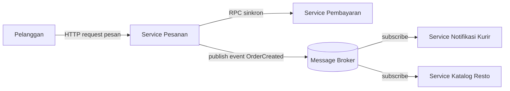
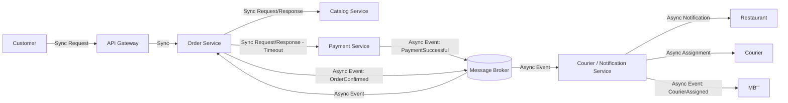

# Tugas 2 (Pekan 2) — Perancangan Arsitektur untuk FoodGo

**Materi terkait:** Architectural style (Layered, SOA, Peer-to-Peer, Publish-Subscribe).

## Studi Kasus

Melanjutkan Tugas 1: FoodGo butuh sistem yang **decoupled** agar tim kurir dan tim resto tidak saling mengganggu ketika salah satu modul diperbarui/deploy ulang. Saat ini semua modul (pesanan, pembayaran, notifikasi kurir, katalog resto) berjalan sebagai satu aplikasi monolitik — sekali deploy, semua modul ikut restart dan berisiko downtime total.

## Tugas Kelompok

1. Pilih **satu** gaya arsitektur utama: **Service-Oriented Architecture (SOA)** atau **Publish-Subscribe**. Boleh dikombinasikan (mis. SOA untuk service inti + Pub-Sub untuk notifikasi), tapi harus dijustifikasi kenapa kombinasi ini yang dipilih.
2. Gambarkan minimal 4 komponen berikut dan interaksinya: modul Pesanan, modul Pembayaran, modul Kurir/Notifikasi, modul Katalog Resto (dan message broker/API gateway jika relevan).
3. Jelaskan alur satu skenario penuh secara end-to-end di diagram (misalnya: pelanggan buat pesanan → bayar → resto terima notifikasi → kurir ditugaskan) — tunjukkan komponen mana berkomunikasi dengan siapa, dan **jenis komunikasinya** (sinkron/asinkron, request-response/event).
4. Analisis tertulis: kenapa gaya ini mengatasi masalah *coupling* dari Tugas 1, dan apa trade-off-nya (mis. Pub-Sub menambah kompleksitas debugging karena alur tidak linear).

## Cara Membuat Diagram (Gratis, Cukup Laptop)

Tidak perlu software berbayar. Dua opsi:

**Opsi A — Mermaid di dalam Markdown (disarankan).** Ditulis sebagai teks biasa di `README.md`, otomatis dirender jadi diagram oleh GitHub — tidak perlu install apa pun.

````markdown

````

**Opsi B — draw.io / diagrams.net** (gratis, jalan di browser tanpa akun, atau app desktop offline di [app.diagrams.net](https://app.diagrams.net/)). Ekspor sebagai `.png` dan simpan di folder `diagram/`.

## Struktur Submission

```
tugas-02-perancangan-arsitektur/
├── README.md          # Analisis + diagram Mermaid (jika Opsi A) atau referensi ke diagram/
├── JURNAL.md
└── diagram/            # File .png/.drawio jika pakai Opsi B
```

## Rubrik Penilaian (Tugas 2)

| Komponen | Bobot | Kriteria |
|---|---|---|
| Ketepatan pemilihan gaya arsitektur | 20% | Justifikasi SOA/Pub-Sub sesuai kebutuhan *decoupling* di skenario |
| Kelengkapan & kejelasan diagram | 30% | Semua komponen kunci ada, jenis komunikasi (sinkron/asinkron) jelas ditandai |
| Analisis trade-off | 30% | Bukan hanya kelebihan — kekurangan/kompleksitas baru juga dibahas |
| Proses & kontribusi kelompok | 20% | `JURNAL.md`, commit history |

## Batasan Penggunaan AI (Level 2)

Kebijakan **Level 2 (AI Assisted Idea Generation & Structuring)** berlaku — lihat [`../RUBRIK-UMUM.md`](../RUBRIK-UMUM.md). Boleh memakai AI untuk brainstorming komponen apa saja yang umum ada di gaya arsitektur SOA/Pub-Sub; **tidak boleh** meminta AI menggambar diagram final atau menuliskan analisis trade-off yang tinggal ditempel. Catat pemakaian AI di "Log Penggunaan AI" pada `JURNAL.md`.

- Diagram Mermaid/draw.io yang "terlalu generik" (identik dengan contoh tutorial di internet tanpa penyesuaian ke kasus FoodGo) akan dinilai rendah pada komponen kelengkapan & kejelasan diagram.


## Jawaban diskusi kami:

1. Kami memiih Service-Oriented Architecture(SOA) yang dikombinasikan dengan Publish-Subscribe. SOA berfungsi untuk memisahkan sistem menjadi beberapa service, seperti Pesanan, Pembayaran, Katalog Resto, dan Kurir/Notifikasi. Publish-Subscribe untuk komunikasi asinkron melalui Message Broker untuk event seperti pembayaran berhasil, notifikasi restoran, dan penugasan kurir.

2. Diagram


3. Alur dimulai ketika pelanggan membuat pesanan melalui aplikasi FoodGo. Pesanan dikirim ke API Gateway secara sinkron menggunakan request-response, kemudian diteruskan ke Order Service. Order Service melakukan pengecekan menu, harga, dan ketersediaan ke Catalog Service secara sinkron. Setelah itu, Order Service mengirim permintaan pembayaran ke Payment Service secara sinkron dengan menggunakan timeout agar sistem tidak menunggu tanpa batas waktu.
   Jika pembayaran berhasil, Payment Service mengirim event "PaymentSuccessful" ke Message Broker secara asinkron. Event tersebut kemudian diterima oleh Order Service untuk mengonfirmasi pesanan. Setelah pesanan dikonfirmasi, Order Service mengirim event "OrderConfirmed" ke Message Broker.
   Message Broker kemudian meneruskan event tersebut ke Courier/Notification Service secara asinkron. Service ini mengirim notifikasi pesanan kepada restoran dan melakukan penugasan kurir. Setelah kurir ditugaskan, informasi penugasan dikirim kepada kurir secara asinkron. Dengan cara ini, proses yang membutuhkan respons langsung menggunakan komunikasi sinkron, sedangkan notifikasi dan pembaruan status menggunakan komunikasi asinkron melalui Message Broker.

4. Analisis Coupling dan Trade-off
Arsitektur yang digunakan pada FoodGo adalah **Service-Oriented Architecture (SOA) yang dikombinasikan dengan Publish-Subscribe (Pub-Sub)**. SOA memisahkan sistem menjadi beberapa service, seperti Order Service, Payment Service, Catalog Service, dan Courier/Notification Service. Dengan pemisahan tersebut, setiap service dapat dikembangkan, diperbarui, dan di-*deploy* secara lebih independen tanpa harus melakukan *restart* seluruh sistem.
  Arsitektur ini dapat mengurangi masalah **coupling** pada FoodGo yang sebelumnya menggunakan arsitektur monolitik. Pada sistem monolitik, modul Pesanan, Pembayaran, Katalog Resto, dan Kurir/Notifikasi berada dalam satu aplikasi. Akibatnya, perubahan atau *deployment* pada satu modul dapat memengaruhi modul lainnya dan berisiko menyebabkan *downtime* pada seluruh sistem. Dengan SOA, setiap fungsi dipisahkan menjadi service sehingga perubahan pada satu service tidak secara langsung mengharuskan service lainnya ikut di-*deploy* atau di-*restart*.
  Selain itu, **Pub-Sub** digunakan untuk mengurangi ketergantungan langsung antar-service dalam komunikasi asinkron. Service dapat mengirim (*publish*) event ke Message Broker, kemudian service yang membutuhkan informasi tersebut dapat menerima (*subscribe*) event tersebut. Contohnya, Payment Service menerbitkan event `PaymentSuccessful` ke Message Broker, kemudian Order Service menerima event tersebut untuk mengonfirmasi pesanan. Payment Service tidak perlu berkomunikasi langsung dengan kode internal Order Service.
  Namun, penggunaan SOA dan Pub-Sub juga memiliki beberapa **trade-off**. Sistem menjadi lebih kompleks karena terdiri dari beberapa service dan membutuhkan komponen tambahan seperti Message Broker. Komunikasi asinkron juga membuat alur proses tidak selalu linear sehingga **debugging dan tracing** menjadi lebih sulit. Selain itu, terdapat kemungkinan event terlambat diproses, gagal diproses, atau diproses lebih dari satu kali. Oleh karena itu, sistem membutuhkan mekanisme tambahan seperti **logging, monitoring, retry, timeout, dan idempotency**.
  Dengan demikian, kombinasi SOA dan Pub-Sub membantu FoodGo menjadi lebih **decoupled**, sehingga setiap service dapat dikembangkan dan di-*deploy* secara lebih independen. Trade-off yang muncul adalah meningkatnya kompleksitas dalam komunikasi antar-service, monitoring, dan proses debugging.

